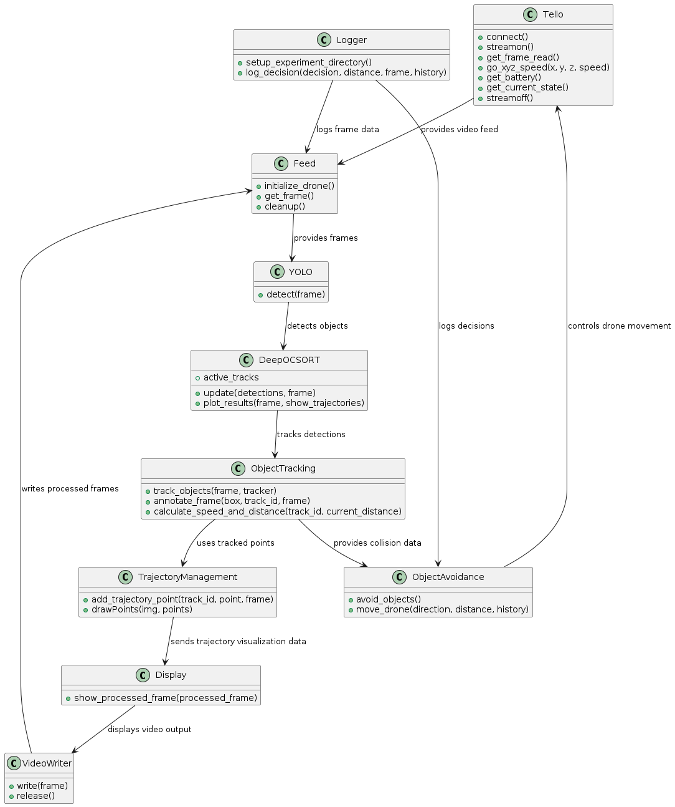

# 🛩️ DJI Tello Drone: Autonomous Obstacle Detection and Avoidance
**Project Dates:** August 2024 – December 2024  
**GitHub:** [Guruvaraprasad1225](https://github.com/Guruvaraprasad1225)  
**LinkedIn:** [Borra Guruvaraprasad](https://www.linkedin.com/in/borra-guruvaraprasad)

---

## 📚 Table of Contents
- [Project Overview](#project-overview)
- [Key Features](#key-features)
- [Technologies Used](#technologies-used)
- [System Architecture](#system-architecture)
- [Video Demonstration](#video-demonstration)
- [Setup & Usage](#setup--usage)
- [Challenges & Solutions](#challenges--solutions)
- [Performance Logs](#performance-logs)
- [Project Documentation](#project-documentation)
- [Future Work](#future-work)

---

## 📌 Project Overview
Enabling compact, low-cost drones like the DJI Tello to navigate autonomously and safely in environments with static and dynamic obstacles.

This system uses **YOLOv8** for real-time object detection and **DeepOCSORT** for multi-object tracking. A reactive avoidance logic based on **Time-To-Collision (TTC)** ensures the drone dynamically adjusts its flight path, avoiding potential collisions with tracked objects.

---

## ✨ Key Features
- 🔍 **Real-Time Object Detection** — YOLOv8 applied to every video frame for efficient object localization  
- 🧠 **Robust Multi-Object Tracking** — DeepOCSORT assigns persistent IDs across frames for dynamic analysis  
- 🚁 **Autonomous Obstacle Avoidance** — Movement decisions based on proximity and threat classification  
- 🧬 **Stable Flight Command Heartbeat** — Multithreaded keep-alive mechanism to override Tello’s auto-landing  
- 📊 **Performance Logging** — Real-time experiment data, movement history, and decision logs for post-flight review

---

## 🧠 Technologies Used
- **Drone**: DJI Tello
- **Programming Language**: Python 3.8+
- **Machine Learning Framework**: PyTorch (used via YOLOv8 for detection pipeline)
- **Computer Vision**: OpenCV, Ultralytics (YOLOv8), Boxmot (DeepOCSORT)
- **Drone SDK**: `djitellopy`
- **OS**: Windows 11 / Linux
- **Libraries**: NumPy, pynput, threading, argparse, math, datetime

---

## 🧭 System Architecture
- Tello streams live video (`get_frame()`)
- `main.py` processes incoming frames
- YOLOv8 model identifies objects
- DeepOCSORT tracks objects across frames with unique IDs
- Avoidance logic calculates TTC and relative positions
- Drone receives movement commands via `move_drone()`
- A secondary thread handles `keep_alive()` signals for stable operation

> 📷 *Optional:* Embed a system diagram  
```markdown

